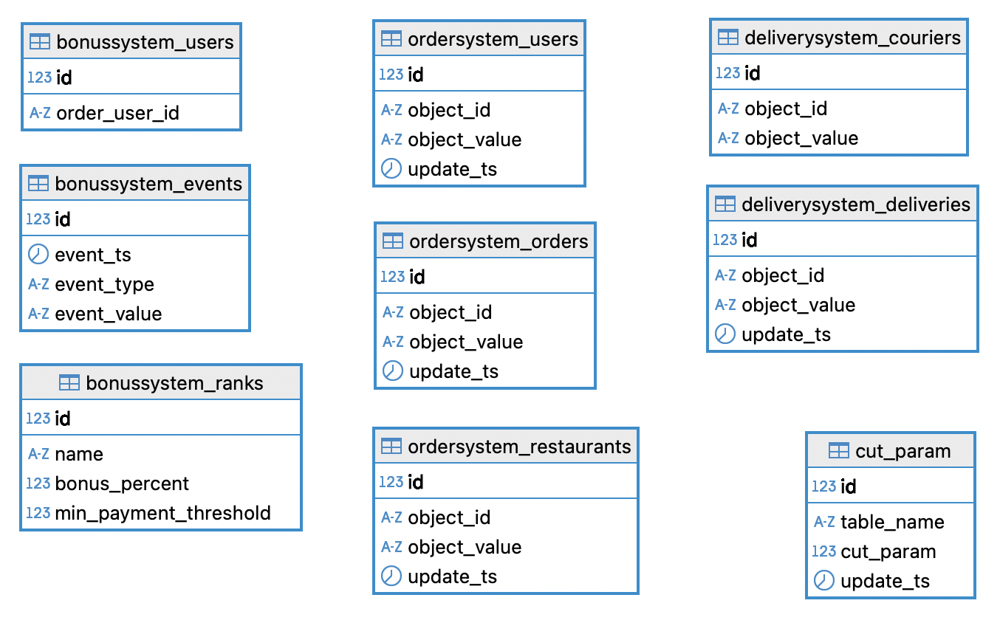
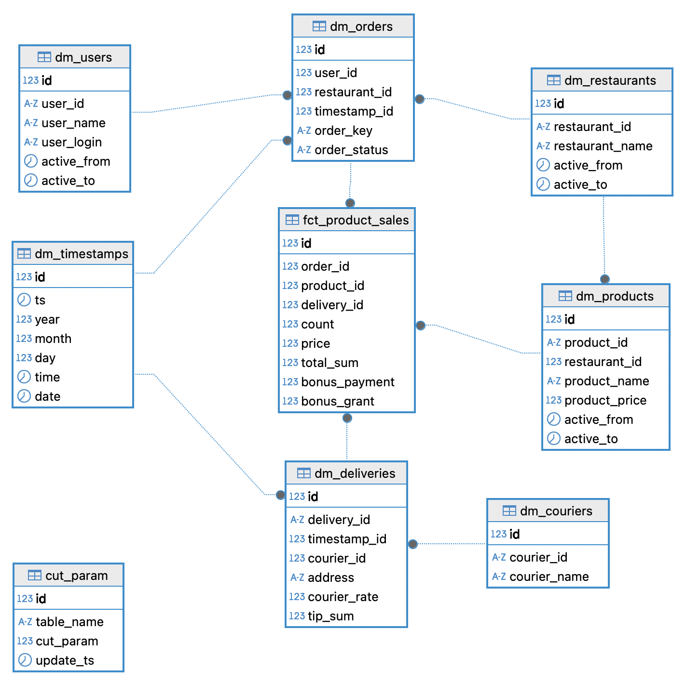
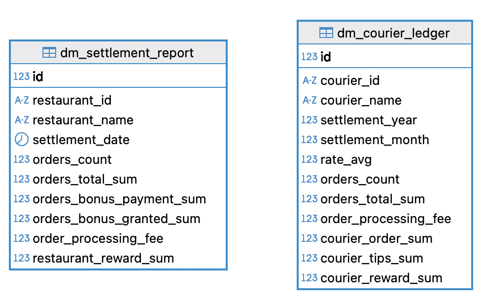
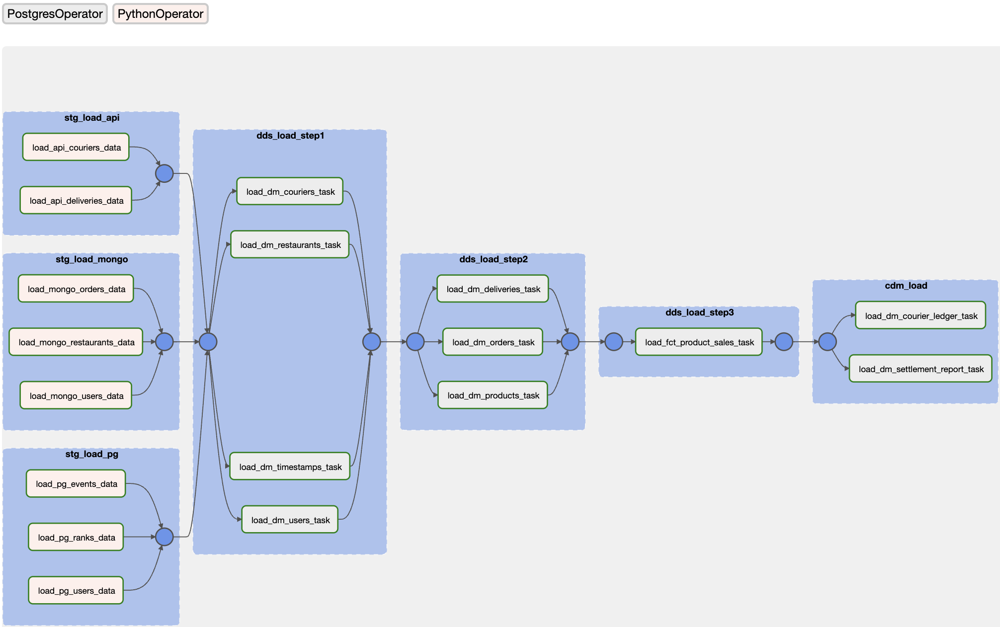

# DWH для нескольких источников

`postgresql` `mongodb` `api` `airflow` `docker` 

---

**Описание хранилища**

Компания приняла решение запустить собственную доставку блюд из ресторанов. Для этого разработали следующие системы-источники:
* система обработки заказов (Order System)
* система оплаты баллами (Bonus System)
* система курьерской доставки (Delivery System)

Многослойная архитектура хранилища позволяет обеспечивать хорошее качество данных и скорость работы с ними, поэтому хранилище построено на базе PostgreSQL и состоит из минимально необходимых для решения данной задачи трех слоёв:
* STG (Staging) представляет собой хранение данных as is для трех источников: реляционного PostgreSQL (Bonus System), нереляционного MongoDB (Order System) и API (Delivery System)



* DDS (Detail Data Storage) — ядро хранилища в модели "Cнежинка" с измерениями "Курьер", "Пользователь", "Ресторан", "Время", "Доставка", "Заказ", "Продукт" и фактовой таблицей продаж продуктов, ссылочная целостность поддерживается



* CDM (Customer Data Marts) - широкие пользовательские витрины взаиморасчетов с ресторанами и выплат курьерам согласно требованиям от заказчика



Оркестрация загрузки данных в слои происходит с помощью Airflow (даг `dags/dwh_main_dag.py`). Слой STG загружается с помощью PythonOperator - функции `load_pg_data()`, `load_mongo_data()` и `load_api_data()` для каждого типа источника соответственно, DDS загружается PostgresOperator - sql-скриптами `update_<schema_name_table_name>.sql` из папки `src/ddl_scripts`. На слоях STG и DDS для всех таблиц реализована инкрементальная загрузка с помощью таблиц `stg.cut_param` и `dds.cut_param`, где в атрибут `cut_param` пишется положение курсора предыдущей загрузки - максимальный загруженный id или timestamp в формате Unix. DDL всех таблиц находится в файле `src/ddl_scripts/ddl.sql`



---

**Структура репозитория**

```
├── README.md
├── dags
│   └── dwh_main_dag.py
├── docker-compose.yaml
└── src
    ├── ddl_scripts
    │   ├── ddl.sql
    │   ├── select_stg_bonussystem_events.sql
    │   ├── select_stg_bonussystem_ranks.sql
    │   ├── select_stg_bonussystem_users.sql
    │   ├── select_stg_cut_param.sql
    │   ├── update_cdm_dm_courier_ledger.sql
    │   ├── update_cdm_dm_settlement_report.sql
    │   ├── update_dds_dm_couriers.sql
    │   ├── update_dds_dm_deliveries.sql
    │   ├── update_dds_dm_orders.sql
    │   ├── update_dds_dm_products.sql
    │   ├── update_dds_dm_restaurants.sql
    │   ├── update_dds_dm_timestamps.sql
    │   ├── update_dds_dm_users.sql
    │   └── update_dds_fct_product_sales.sql
    └── images
        ├── cdm.png
        ├── dds.png
        ├── graph.png
        └── stg.png
```
